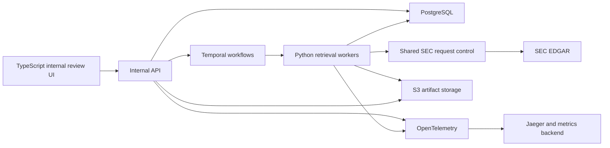

# Production Scaling Plan

**Status:** active implementation blueprint; Milestone 7.3 complete

**Current point:** SQLite and PostgreSQL implement the durable operations
contract, local CAS/S3 adapters implement immutable artifact references, and a
local/Temporal Cloud-neutral worker implements durable orchestration. Shared SEC
traffic control, the API/review application, observability, and deployment
validation remain later phases.

This document describes how the current Python CLI could become a durable
internal cloud service and review application. `ROADMAP.md` decides when the
work should occur. This document describes the intended architecture, migration
sequence, risks, and decisions that must be revisited before implementation.

The production goal is not simply to run the existing CLI in Kubernetes. The
goal is to preserve its evidence and correctness contracts while adding durable
execution, shared SEC rate control, persistent storage, an internal API,
operator review, and observability.

## 1. Product goal

Provide an internal service that can:

1. Accept one ticker, a batch, or a scheduled universe.
2. Resolve the strongest available SEC identity.
3. Retrieve and validate the applicable prospectus package.
4. Return verified results without waiting on a synchronous SEC request.
5. Route ambiguous results to manual review instead of guessing.
6. Preserve the exact source evidence, policy version, and reviewer decisions.
7. Resume interrupted work safely and avoid duplicate artifacts.

The web application is an interface to this service. It must not call EDGAR
directly or hold a browser request open while the complete pipeline runs.

## 2. Readiness assessment

### Reusable from the current project

- Resolver and SEC identity models
- Class-first, series-fallback, and registrant-only discovery behavior
- Filing priority and selection provenance
- Primary-document resolution
- Runtime SEC response validation
- Deterministic document classification and evidence validation
- Supplement/base-prospectus package construction
- Manifest, checksum, and warning contracts
- Persistent job, item, lease, artifact, and review-task contracts
- Explicit idempotency-key/request-fingerprint semantics
- SQLite reference adapter for deterministic durability and recovery tests
- PostgreSQL repository with Alembic migrations, server-time leases, and
  `SKIP LOCKED` work claims
- Local content-addressed and S3 artifact-store adapters
- Deterministic and opt-in live tests

These modules should become domain and application services used by both the
CLI and a worker. The CLI should remain available for local diagnostics and
administrative use.

### Remaining redesign

- The process-local SEC limiter becomes a service-wide limiter.
- Synchronous CLI control flow becomes durable workflow orchestration.
- Broad operational failures become typed retryable or non-retryable outcomes.
- Console logs become structured logs, traces, and metrics.
- Pending review tasks gain authorized reviewer decisions and audit events.
- API responses expose durable artifact references and suppress diagnostic
  worker-local paths.
- AWS account, IAM, KMS, bucket-policy, failover, and retention contracts are
  validated in the target environment.

### Entry criteria

Before unattended production use:

1. Milestone 5 has removed bounded filing discovery and added sibling recovery.
2. Milestone 6 has produced a measured evidence policy and labeled corpus.
3. Package and manifest schemas are versioned and migration rules are defined.
4. Review-required behavior is accepted as a normal product state.
5. The supported ticker universe and CIK-only policy are explicit.

Milestones 8 and 9 are not technical blockers if unresolved or CIK-only cases
are allowed to fail closed or enter review. They are product-coverage blockers
if the service promises verified output for those cases.

## 3. Target architecture



### Component responsibilities

| Component | Responsibility |
|---|---|
| TypeScript UI | Submit work, show evidence, compare documents, and resolve review tasks. |
| Internal API | Authenticate users, validate requests, create jobs, and serve stored results. |
| Temporal | Persist orchestration state, schedule batches, retry activities, and wait for review decisions. |
| Python workers | Execute the existing resolver, EDGAR, validator, and package logic. |
| Shared SEC request control | Enforce aggregate request pacing across every worker and process. |
| PostgreSQL | Store jobs, identities, filings, policies, evidence, reviews, and state transitions. |
| S3 | Store HTML, PDFs, manifests, SEC index snapshots, and immutable checksummed artifacts. |
| OpenTelemetry and Jaeger | Correlate API requests, workflows, activities, SEC calls, and failures. |
| EKS | Run API, workers, UI, and supporting services as independently scalable workloads. |
| Istio | Apply the team's standard service routing, identity, and traffic policies if required. |

### Technology choices aligned with the target team

- **Python:** retrieval and validation workers, minimizing domain-logic rewrites.
- **TypeScript:** internal review UI.
- **Go, TypeScript, or Python:** API, selected according to the team's service
  conventions rather than for take-home-project consistency.
- **Temporal:** durable orchestration, retries, schedules, and review waits.
- **PostgreSQL:** durable relational state and audit history.
- **AWS S3:** immutable document and evidence storage.
- **AWS EKS:** container deployment and independent workload scaling.
- **Istio:** service networking only when the deployed topology justifies it.
- **OpenTelemetry and Jaeger:** traces correlated by job, workflow, and ticker.
- **OpenAI APIs:** optional assistance for review or summarization, never an
  authority that silently upgrades a correctness result.

Kafka is not required for the first version. Temporal already provides durable
workflow task delivery and retry state. Kafka would be justified later only if
the organization needs a reusable event stream for multiple independent
consumers, not merely a queue for this pipeline.

## 4. End-to-end request flow

1. A user submits ticker(s), or a Temporal schedule starts a nightly batch.
2. The API normalizes the request, creates a durable job, and returns a job ID.
3. Temporal starts one child workflow per ticker or another bounded unit of work.
4. Python activities execute the identity, filing, document, and validation
   stages.
5. Every EDGAR call passes through shared request control.
6. Documents and manifests are written to S3; activities return only small
   references, checksums, and evidence summaries.
7. PostgreSQL records each stage and the final confidence state.
8. Verified results become available through the API.
9. Ambiguous results create review tasks. The workflow may wait for an approved,
   rejected, or corrected decision.
10. A reviewer decision is stored as an auditable event and completes or
    redirects the workflow.

Example API surface:

```text
POST /v1/prospectus-jobs
GET  /v1/prospectus-jobs/{job_id}
GET  /v1/prospectus-jobs/{job_id}/results
GET  /v1/funds/{ticker}/latest
GET  /v1/reviews?status=pending
POST /v1/reviews/{review_id}/decision
```

`POST /v1/prospectus-jobs` should return `202 Accepted` with a job ID. It should
not wait for SEC retrieval to finish.

## 5. Temporal workflow design

### Workflow stages

```text
resolve identity
  -> discover filing candidates
  -> select filing
  -> resolve document inventory
  -> download and validate documents
  -> recover sibling or base documents when needed
  -> persist package
  -> publish verified result or create review task
```

Each external call or side effect belongs in an Activity. Workflow code should
only coordinate durable state and decisions because Temporal may replay it.

Suggested Activities:

- `resolve_identity`
- `discover_filings`
- `resolve_accession_documents`
- `download_document`
- `validate_document`
- `find_base_prospectus`
- `recover_sibling_document`
- `persist_package`
- `create_review_task`
- `publish_result`

Long candidate scans should heartbeat their progress so a retry can continue
from known state. A batch should use child workflows rather than placing 5,000
tickers into one unbounded workflow history.

### Retry ownership

Retries must not be layered accidentally between `requests`, `SECClient`, and
Temporal. The production design should assign clear ownership:

- Retry `429`, timeouts, temporary network failures, and selected `5xx`
  responses with bounded exponential backoff and jitter.
- Honor the SEC `Retry-After` header when present.
- Do not retry incompatible SEC schemas, unsafe filenames, invalid identifiers,
  or deterministic validation failures without a code or policy change.
- Treat insufficient evidence as `manual_review_required`, not as a transport
  exception.
- Preserve the final error category and every retry attempt in telemetry.

## 6. SEC rate compliance

This is the primary scaling constraint. The current limiter protects only one
Python process. Multiple EKS pods or simultaneous CLI processes can collectively
send more traffic than intended.

Recommended first production design:

1. Route all SEC traffic through one logical egress component.
2. Coordinate a global token bucket or next-request timestamp in shared state.
3. Keep the configured rate below the SEC ceiling to preserve safety margin.
4. Pace adapter retries through the same limiter.
5. Reduce duplicate SEC calls with persistent metadata caching.
6. Record request category, status, latency, retry count, and throttle wait.

A single egress pod is simple but not highly available. A production version can
run multiple replicas only when the limiter is coordinated through shared state,
such as PostgreSQL or another team-approved distributed store. Worker concurrency
alone does not enforce requests per second.

## 7. Persistence and idempotency

### PostgreSQL records

At minimum, persist:

- request and batch IDs;
- normalized ticker and requested as-of time;
- CIK, series ID, class ID, and identity level;
- candidate and selected accessions;
- form, filing date, policy version, and selection reason;
- artifact keys, source URLs, byte size, and SHA-256 checksums;
- validation signals, contradictions, and confidence state;
- workflow and activity status;
- retry and error history;
- review task, reviewer, decision, reason, and timestamp.

### Idempotency rules

- Use a stable workflow key such as
  `prospectus:{ticker}:{as_of_date}:{policy_version}` for scheduled work.
- Apply database uniqueness constraints to logical results.
- Store artifacts under accession- and checksum-based keys.
- Before downloading, check whether the immutable accession artifact already
  exists and passed integrity validation.
- Retrying an Activity must produce the same stored result or safely observe the
  existing result.

Do not pass full HTML or PDF bytes through Temporal workflow state. Persist them
to S3 and return an artifact reference plus checksum.

## 8. Caching policy

Persistent caches reduce SEC traffic but must not hide freshness requirements.

| Data | Candidate policy |
|---|---|
| SEC ticker mappings | Cache with retrieval time, schema version, and scheduled refresh. |
| Registrant submissions | Short TTL plus conditional refresh where supported. |
| Atom or filing metadata | Cache by request parameters and retrieval time. |
| Accession index | Treat as immutable after filing acceptance, subject to rare correction handling. |
| Downloaded document | Store immutably by accession, path, and checksum. |
| Validation result | Key by document checksum and validation-policy version. |

Every cached record should retain its SEC source URL and retrieval timestamp.

## 9. Review application

The first useful UI is operational, not promotional. It should support:

- single-ticker, pasted batch, and file submission;
- job progress and per-ticker outcomes;
- identity level and document-verification status;
- filing-selection evidence and skipped alternatives;
- side-by-side supplement and base-prospectus inspection;
- accession sibling inventory and validator reasons;
- approve, reject, or select-alternative actions;
- re-run under a newer policy version;
- artifact download and audit history.

The UI must visually distinguish:

- `document_verified`;
- `manual_review_required`;
- unresolved identity;
- retrieval failure;
- stale result awaiting refresh.

Review decisions must not overwrite machine evidence. They should be appended as
separate, attributable audit events.

## 10. Observability

Every API request, workflow, activity, and SEC call should share correlated
identifiers:

- request ID and batch ID;
- Temporal workflow ID and run ID;
- ticker and resolved identity level;
- accession number when known;
- process, pod, and worker identity;
- policy and manifest schema versions.

Required metrics:

- queue depth and oldest job age;
- completed, failed, and review-required counts;
- duration by pipeline stage;
- SEC request rate, `429` rate, timeout rate, and throttle wait;
- retries by category;
- SEC schema-validation failures;
- cache hit rate;
- candidates and documents evaluated per ticker;
- confidence distribution and reviewer override rate.

Tracing should make it possible to open one ticker result and follow it from the
API through Temporal activities to each SEC request and stored artifact.

## 11. Security and compliance

Although SEC documents are public, the service still needs operational controls:

- authenticated internal access and role-based review actions;
- service identities rather than embedded AWS credentials;
- encryption in transit and at rest;
- private storage buckets with controlled download URLs;
- immutable checksums and source provenance;
- audit logs for policy and human decisions;
- dependency and container scanning;
- explicit retention and deletion policies;
- no issuer-site or AI-generated evidence silently overriding SEC evidence.

## 12. Deployment model

Build and deploy separate containers for:

1. Internal API
2. Python Temporal worker
3. TypeScript web UI
4. SEC egress/rate-control component, if implemented separately

Use EKS Deployments and Services, with independent resource requests and scaling
policies. Store images in the team's container registry. Use managed PostgreSQL
and S3 according to the team's AWS standards. Apply Istio only according to the
existing platform conventions; it should not be introduced solely to make the
project appear production-like.

The API and UI may scale on request load. SEC-facing workers must scale under the
global SEC budget, not simply on queue depth.

## 13. Scale model and rollout

SEC request budget, rather than CPU, is likely to determine throughput. For
example, 5,000 tickers averaging four uncached SEC requests would require 20,000
requests. At an internal target of eight requests per second, the theoretical
request floor is about 42 minutes before transfer time, retries, supplement
recovery, and manual review. The actual request distribution must be measured.

Roll out progressively:

| Stage | Scope | Required evidence before proceeding |
|---|---|---|
| 1 | 100 curated tickers | Correctness corpus passes; no unexplained wrong-document selections. |
| 2 | 1,000 tickers | Stable rate control, resumability, cache behavior, and review workload. |
| 3 | 5,000 tickers | Nightly completion target met with acceptable SEC and review metrics. |
| 4 | Ongoing service | Scheduled contract tests, alerts, runbooks, and capacity review. |

The test universe must include providers, identity levels, form types,
supplements, combined filings, CIK-only cases, unresolved tickers, malformed SEC
responses, `429` responses, and interrupted workflows.

## 14. Implementation phases

### Phase P0: Freeze production contracts

**Status:** substantially complete; reviewer decision semantics remain open

- Complete the active correctness milestones.
- Version manifests, evidence policies, and job outcomes.
- Define retryable, review-required, rejected, and failed states.

**Exit:** deterministic inputs produce stable, versioned output contracts.

### Phase P1: Extract service boundaries

**Status:** complete

- Separate orchestration from resolver, retrieval, validation, and persistence.
- Introduce artifact-store and repository interfaces.
- Keep the CLI running through the same application service.

**Exit:** local and service callers use one domain pipeline without duplicated
selection logic.

### Phase P2: Add durable persistence

**Status:** implementation complete; deployment validation pending

- Add PostgreSQL job and evidence records.
- Add S3 artifact storage.
- Implement idempotency and artifact integrity checks.

**Exit:** interrupted local workers can resume without duplicate or lost output.

### Phase P3: Add Temporal orchestration

**Status:** implementation complete; deployment validation pending

- Implement one workflow per ticker and bounded batch coordination.
- Move network and storage side effects into Activities.
- Configure typed retries, heartbeats, cancellation, and review waits.

**Implemented boundary:** bounded child workflows, typed retry ownership,
candidate-boundary heartbeats, byte-free workflow payloads, and completed-stage
resume are implemented and covered by an official Temporal test-server
contract. Long-lived review waits belong to the review product in Phase P5.

**Exit:** target Temporal Cloud/EKS restart and failure-injection tests confirm
that worker termination and transient failures recover without restarting
completed stages.

### Phase P4: Enforce global SEC traffic policy

**Status:** not started

- Implement shared request pacing and coordinated retry behavior.
- Add persistent metadata caching and request instrumentation.
- Test simultaneous workers and processes.

**Exit:** aggregate traffic remains within policy during concurrency, retries,
and failover.

### Phase P5: Add API and review UI

**Status:** not started

- Add asynchronous job endpoints and stored-result endpoints.
- Build the manual-review queue and evidence inspection UI.
- Add authentication, authorization, and decision audit history.

**Exit:** operators can submit, monitor, review, and retrieve results without CLI
or database access.

### Phase P6: Deploy and operate on AWS

**Status:** not started

- Deploy API, workers, and UI to EKS.
- Add OpenTelemetry, Jaeger integration, metrics, alerts, and dashboards.
- Create backup, restore, rollback, incident, and SEC-throttling runbooks.

**Exit:** the service has defined service objectives, alerts, recovery tests, and
an accountable owner.

### Phase P7: Scale validation

**Status:** not started

- Run the 100, 1,000, and 5,000-ticker progression.
- Measure correctness, completion time, request amplification, cache efficiency,
  and review burden.
- Tune only from measured bottlenecks.

**Exit:** the service meets the agreed nightly and on-demand product objectives.

## 15. Principal challenges

| Challenge | Failure if ignored | Planned control |
|---|---|---|
| Correctness at scale | Faster production of wrong documents | Complete recovery and evidence-policy milestones before unattended use. |
| Distributed rate limiting | Multiple workers collectively trigger SEC throttling | Shared request control and centralized retry pacing. |
| Duplicate execution | Retries create duplicate jobs or conflicting artifacts | Stable keys, uniqueness constraints, immutable storage, and idempotent Activities. |
| Large workflow payloads | Expensive and fragile orchestration state | Store bytes in S3; pass references and checksums. |
| External contract changes | SEC schema changes become false empty results | Runtime schemas, scheduled live contracts, and alerts. |
| Review backlog | Ambiguous work accumulates without ownership | Review queue metrics, age alerts, and explicit service objectives. |
| Overuse of AI | Plausible generated conclusions override evidence | Keep deterministic SEC evidence authoritative; use AI only as review assistance. |
| Premature infrastructure | Complexity grows before contracts are stable | Implement phases only after their entry and exit criteria are met. |

## 16. Decisions required during implementation

Do not silently assume answers to these questions. The immediate Milestone 7.3
choices are workflow boundaries and retry ownership between `SECClient` and
Temporal Activities; the remaining choices become blocking only in their
owning phase.

1. What ticker universe and nightly completion objective are required?
2. Are registrant-only verified documents acceptable, or must they always enter
   review until identity enrichment succeeds?
3. Which outcomes may downstream systems consume automatically?
4. How long must source artifacts, manifests, and audit events be retained?
5. What is the approved service-wide SEC request budget and safety margin?
6. Does the team prefer a Go, TypeScript, or Python API?
7. Is PostgreSQL sufficient for distributed rate state, or is another approved
   shared store available?
8. Does the organization operate Temporal Cloud or self-host Temporal?
9. Which authentication and authorization system must the internal UI use?
10. What manual-review turnaround and escalation policy is acceptable?
11. Are issuer or exchange sources approved as corroborating evidence?
12. What service objectives, availability target, and disaster-recovery target
    are required?

## 17. Assumptions for this proposed architecture

- SEC EDGAR remains the automated source of record.
- Correctness and honest review states have priority over coverage and speed.
- The first service is internal rather than public customer-facing software.
- Documents are immutable evidence artifacts once stored and checksummed.
- A result is served from durable storage; the API does not retrieve from SEC
  synchronously.
- Temporal coordinates work but does not replace PostgreSQL, object storage,
  global rate control, or observability.
- The web UI is an operational review tool, not the system of record.
- AI-generated analysis may assist a reviewer but cannot independently establish
  fund identity or document verification.

## 18. Reference material

- SQLAlchemy `FOR UPDATE` options: <https://docs.sqlalchemy.org/en/20/core/selectable.html#sqlalchemy.sql.expression.Select.with_for_update>
- PostgreSQL explicit locking: <https://www.postgresql.org/docs/current/explicit-locking.html>
- Alembic migration commands: <https://alembic.sqlalchemy.org/en/latest/api/commands.html>
- S3 checksum validation: <https://docs.aws.amazon.com/AmazonS3/latest/userguide/checking-object-integrity-upload.html>
- S3 conditional writes: <https://docs.aws.amazon.com/AmazonS3/latest/userguide/conditional-writes.html>
- Temporal concepts and durable execution: <https://docs.temporal.io/>
- Temporal Python SDK: <https://python.temporal.io/>
- AWS EKS workload concepts: <https://docs.aws.amazon.com/eks/latest/userguide/eks-workloads.html>
- OpenTelemetry Python: <https://opentelemetry.io/docs/languages/python/>
